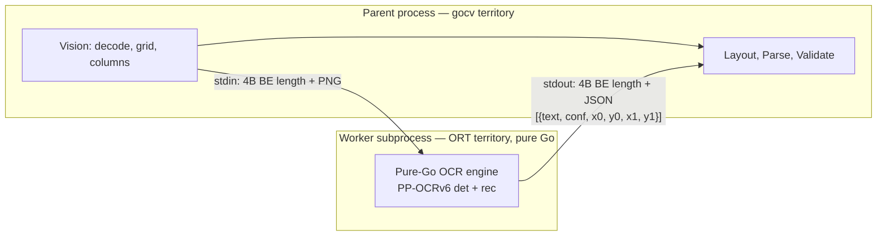
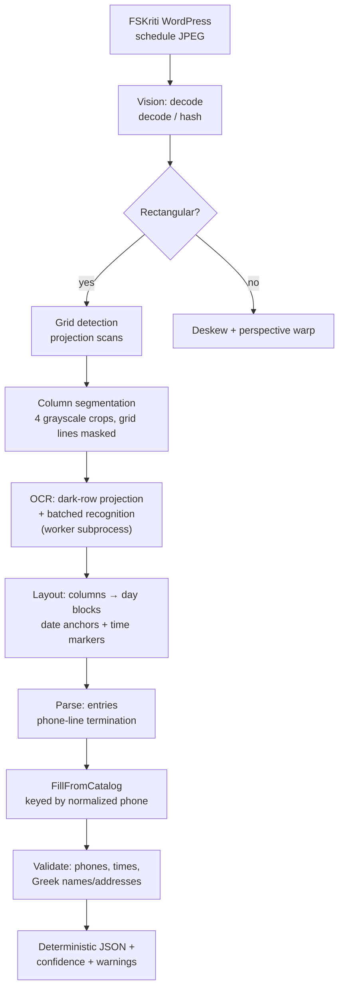
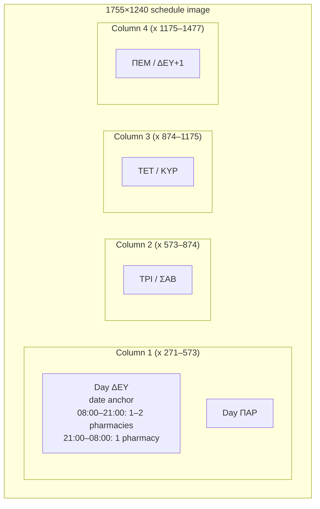

# From PDFs and Greek OCR Chaos to a Deterministic Pharmacy Schedule Pipeline

**A developer story about building `rethymno-emergency-pharmacy` — a local, CPU-only OCR pipeline that turns
a WordPress image gallery into validated JSON.**

**Author:** Marcel Heers · **Date:** 2026-08-14 · **Repo:** `github.com/mheers/rethymno-emergency-pharmacy`

---

## TL;DR

The municipality of Rethymno publishes its weekly **pharmacy duty schedule** as a JPEG image
on a WordPress site ([fskriti.gr](https://fskriti.gr/εφημερίες-φαρμακείων-ρεθύμνου/)).
Every week, someone has to read the image and figure out which pharmacy is open right now —
a perfect candidate for automation.

This project is that automation: a Go library with a thin CLI that downloads the image,
preprocesses it with OpenCV (GoCV), OCRs it with **PP-OCRv6** running on **ONNX Runtime**
(embedded in the binary), reconstructs the table layout, parses the domain entries,
validates them against the municipality's official pharmacy catalog (73 entries, now
enriched with Latin transliterations and lat/lon), and emits deterministic JSON. No
database — the surface is a library, a CLI, and an optional internal HTTP API with a
daily-refreshed cache.

The build involved a few very expensive lessons:

- GoCV + modern glibc crashes on the host — but runs fine in a Debian bookworm container.
- OpenCV and ONNX Runtime **cannot share a process** (heap corruption) — so the OCR engine was
  split into a pure-Go worker subprocess.
- A classic **NCHW vs HWC tensor-order bug** that was nearly invisible because grayscale
  tensors hide the difference.
- PP-OCRv6's recognizer reads Greek as a chaotic mix of **Greek/Latin/Cyrillic look-alikes** —
  solved with a dedicated normalization layer and by keying against a reference catalog.

---

## 1. The problem

Greek pharmacies take turns being "on duty" (εφημερίες) outside normal hours. The Rethymno
pharmacy association publishes the weekly roster as a **single rasterized table image**:

- **1755×1240 px, landscape, 150 DPI**, already perfectly rectangular (white margins).
- A grid of **4 columns × 2 days** = 8 day-blocks per week.
- Each day has two shift blocks: `08:00–21:00` (1–2 pharmacies) and `21:00–08:00` (1 pharmacy).
- Each pharmacy entry is 3–4 text lines: name (Greek), Greek address, a redundant Latin
  transliteration line ending in `STR.`, and a phone line like `ΤΗΛ.28310 34458`.

The catch: it's an *image*, not data. And Greek OCR is notoriously hard — the recognizer sees
`ΔEYTEPA` (Latin E!), `THA` for ΤΗΛ, and `96GERAKARISTR.` for Γερακάρη 96.

There is a second, structured source — the municipality's
[pharmacy duty page](https://www.rethymno.gr/information-services/pharmacies/pharmacies.html) —
and a full [pharmacy catalog](https://www.rethymno.gr/guide/pharmacies). The catalog became the
**validation dictionary**; the structured duty page is the cross-check.

---

## 2. The hard part: three "impossible" debugging sagas

### 2.1 GoCV + glibc 2.39: the host crashes, Docker doesn't

The very first problem: the moment the pipeline read pixels out of a freshly allocated
`cv::Mat` (`GetUCharAt3`), the Go runtime **SIGSEGV'd**. GDB showed the cgo wrapper's stack
slots getting clobbered, the Mat's data pointer pointing at unmapped memory, even the PC
landing on the Mat object. Timing-dependent, `GOGC=off` masked some variants, and a minimal
repro (`NewMatWithSize` + pixel loop + `runtime.GC`) crashed regardless.

The debugging eliminated everything it could:

- Not the kernel (same kernel inside Docker works).
- Not gocv version (v0.31 **and** v0.43 tested).
- Not OpenCV version (4.6 and 4.13).
- Not the Go version (1.24 and 1.25).

Plain C++, plain cgo `malloc`, and Python `cv2` all work on the host. **The Go runtime +
glibc 2.39 + OpenCV allocation mix is broken.** The identical binary runs perfectly in a
Debian bookworm container (glibc 2.36) — which became the sanctioned environment:
**build and test in Docker, never on the host.**

### 2.2 ORT + gocv in one process: always fatal

Next: even *inside* Docker, merely `dlopen`ing `libonnxruntime.so` in a process that also
uses gocv corrupted OpenCV allocations — the next `cv::Mat` allocation got a garbage data
pointer. `nm -D` showed no malloc interposition in ORT's exports (only 3 symbols), so the
root cause stayed unidentified. The lesson: **don't fight it, split the process.**



The consequences were architectural and healthy:

- The worker was rewritten to be **pure Go, no OpenCV**: `internal/ocr/image.go` (raw BGR
  image with bilinear/area resize + crop) and `internal/ocr/dbpostprocess.go` (flood-fill
  connected components instead of `cv::findContours` — fine for axis-aligned text).
- The pipeline talks to a `pipeline.OCRBackend` interface; the CLI's `openEngine` spawns the
  worker via `ocr.StartRemote(os.Executable(), ...)`.
- The protocol is simple and testable: length-prefixed frames over stdin/stdout.

### 2.3 The NCHW tensor-order bug

PP-OCRv6 expects **NCHW** input. The Go code filled the tensor per-pixel (HWC order). The
diagnosis was brutal because a *grayscale* image has equal channels — so the first/last
values of an HWC and an NCHW tensor are indistinguishable, and the model returned
near-zero probability maps that *looked* like a legitimate "no text found" result. Python
reproduced it on the exact same dumped tensor.

The fix: fill channel planes explicitly — `data[y*pw+x]`, `data[plane+y*pw+x]`,
`data[2*plane+y*pw+x]`. And the bug existed at **two** fill sites (det and rec batch fill),
so it had to be fixed twice.

### 2.4 Version pairing: everything is pinned, nothing is optional

| Component | Version | Why |
|---|---|---|
| gocv | `v0.31.0` | matches Debian bookworm's `libopencv-dev` (4.6.0); newer gocv wants newer OpenCV + contrib |
| ONNX Runtime | `1.23.2` (CPU, vendored) | supports yalue's API version |
| yalue/onnxruntime_go | `v1.24.0` | vendors ORT_API_VERSION 22; **v1.32.1 requests API 28 and fails** at session creation |
| PP-OCRv6 models | medium det / small rec | official PaddleX ONNX exports from paddle-model-ecology |

The ORT `.so` is found via `PHARMA_OCR_ORT_LIB` (else `LD_LIBRARY_PATH`, else
`onnxruntime.so`) — set by the Dockerfiles in every run context. With embedded assets the
`.so` is instead materialized to a temp file at startup and `dlopen`ed from there.

---

## 3. PP-OCRv6 quirks (documented so nobody re-derives them)

- **Det preprocessing**: BGR, `(x/255 − mean)/std` with ImageNet mean/std **in BGR order**,
  long side resized to 960, zero-padded to multiples of 32. The resize must be
  **bilinear** (`Image.ResizeBilinear` matches cv2 to max-diff 18/255) — naive area
  averaging kills detections.
- **DB postprocess**: thresh 0.3, box_thresh 0.6, unclip_ratio 1.5, min side 3 — and the
  **score must be computed on the ORIGINAL (pre-unclip) box**, otherwise everything is
  silently rejected.
- **Rec preprocessing**: fixed height 48, width `max(320, ceil(48·w/h))`, **[-1,1]
  normalization** (no ImageNet mean/std — the yml has no NormalizeImage step), pad width to
  multiples of 8. Output sequence length = W/8.
- **CTC decode**: class 0 is the blank symbol; the official exports offset the dictionary
  by one, so output class `c ≥ 1` maps to `char_dict[c-1]`. `dict[0]` is `'!'`.
- **Greek look-alikes**: handled by `normalize.ToGreekUppercase` (Latin look-alike map:
  E→Ε, H→Η, A→Α, …). Since the Greek address line is usually present, the redundant Latin
  transliteration line is dropped entirely.

---

## 4. The current solution

### 4.1 Pipeline overview



Stages (all in `internal/`):

1. **Vision** (`vision/vision.go`, gocv, parent process): decode → is-rectangular check →
   grid detection → 4 column crops. Rectangular schedules **skip the expensive deskew scan**
   entirely, and projection/grid scans use contiguous byte buffers instead of per-pixel cgo
   calls.
2. **OCR** (`ocr/engine.go`, `ocr/columns.go`, `ocr/worker.go`): a fixed-layout fast path —
   `RecognizeColumn` runs **dark-pixel row projection** (`textRowBoxes`) to find text rows,
   skipping the general-purpose DB detector altogether, then batch-recognizes the boxes with
   the **small recognizer**. The pipeline type-asserts an optional `RecognizeColumn`
   interface so the fast path is invisible to callers. This was the "massive speedup".
3. **Layout** (`layout/layout.go`): sorts OCR lines, splits into day blocks using
   **date anchors** (dates are reliable; day names are not — the day is derived from the
   date via Zeller's congruence), then assigns shift content using the `08:00–21:00` /
   `21:00–08:00` time markers.
4. **Parse** (`parse/parse.go`): reconstructs pharmacy entries; a **phone line terminates
   each entry**; Greek/Latin address dedup; junk-line filtering (footer, title rows).
5. **Validate + enrich** (`validate/validate.go`, `pipeline/pipeline.go`): regex checks for
   Greek names/addresses, 10-digit phones, shift times; then `FillFromCatalog` matches each
   entry against the embedded catalog **by normalized phone number**, with
   `chooseCatalogReference` disambiguating duplicate phones by name/address similarity
   (transliterating the address to Latin first), and attaches the catalog's **Latin name,
   Latin address, and OpenStreetMap lat/lon**.

The pipeline is wrapped in a public library (`rethymnoemergency.New` / `Client.Parse*`) with the
OCR models and the ONNX Runtime library embedded via `//go:embed`, and a CLI (`parse` /
`ingest`) that prints JSON to stdout or writes it with `--out`. There is still no database,
but there is an optional `serve` HTTP API (§4.5) for service-to-service consumers.

### 4.2 The image structure, measured once



Grid lines (measured, hardcoded knowledge): verticals at x = 271, 573, 874, 1175, 1477;
horizontals at y = 133, 211, 593, 608, 676, 952, 1096. The 593/608 pair is a double rule,
211 separates the day-1 header, and there is **no separator between a day's two shifts** —
the time-marker text is the only anchor.

### 4.3 Determinism and testing

The output is **deterministic JSON** — same image in, same JSON out — which makes golden
testing trivial:

- `TestGoldenRealSchedule`, `TestGoldenSecondWeek`, `TestGoldenThirdWeek`: the three real
  fixture images (10–17, 17–24, 24–31 Aug 2026) parse to the exact expected schedule —
  correct day names, shifts, phones matching the municipality catalog
  (e.g. Παπατζανή Μαρία 2831023347, Δαφνομήλη Γεωργία 2831056850, Καλογεράκης Ιωάννης
  2831022187). The third week's fixture specifically covers **duplicate-phone
  disambiguation** in the catalog.
- `TestDegradedOCRCaught`: proves the pipeline fails loudly on garbage input instead of
  silently producing wrong data.
- Non-OCR packages (`normalize`, `extract`, `layout`, `parse`, `validate`) are unit-tested
  and run on the host; everything touching gocv/ORT runs in Docker.

### 4.4 CLI and ops

```
rethymno-emergency-pharmacy parse <image> --models <dir>     # image → JSON
rethymno-emergency-pharmacy inspect <image> --models <dir>   # dump diagnostics/debug images
rethymno-emergency-pharmacy ingest --out week.json            # fetch FSKriti + rethymno.gr, cross-check
rethymno-emergency-pharmacy benchmark                         # stage timings
rethymno-emergency-pharmacy serve                             # optional HTTP API, 24h cache
rethymno-emergency-pharmacy ocr-worker --models <dir>         # the ORT-only subprocess
```

`--models` is now optional: the det + rec models and the ONNX Runtime `.so` are embedded
in the binary (`assets_embed.go`), so a plain `go build` after `scripts/bootstrap.sh`
produces a self-contained artifact — only the OpenCV shared libraries are needed at
runtime. Module consumers without the gitignored assets build with `-tags noembed_assets`
and point `ClientConfig.ModelPath` / `PHARMA_OCR_ORT_LIB` at on-disk copies.

### 4.5 The optional HTTP API (`serve`)

The last addition is an optional HTTP API for service-to-service use — a small
`internal/server` package with **no persistence**: an in-memory TTL cache keyed by ISO
week plus a bounded replay index keyed by the image's SHA-256, and a refresh loop that
fetches the upstream schedule image **once a day, unconditionally, at local midnight**
(the schedule can change mid-week, so the cache is never trusted to be current across
days; a failing upstream retries at the next midnight while the last known result keeps
being served). Design details worth stealing:

- **Single-flight fetches**: concurrent requests for the same week coalesce onto one
  upstream fetch; the entry is stored in the cache *before* the flight is removed, so a
  caller can only ever observe either the flight or the cache — never a duplicate fetch.
- **Cache-only requests**: requests are served from the cache whether fresh or stale, so
  the OCR pipeline runs at most once per day and a slow upstream never blocks a client
  that already has data.
- **ETag semantics**: the image SHA-256 doubles as the ETag; `If-None-Match` answers 304
  and `Cache-Control: max-age=<TTL>` tells clients how long to hold the response.
- **Routes**: `GET /healthz`, `GET /schedule/current`, `GET /schedule/week?date=`,
  `GET /schedule/image?sha256=`, and `POST /parse` (multipart image upload for ad-hoc
  images).
- **Testability**: the server is covered by its own suite (`server_test.go`, 449 lines),
  with `now`, `fetchParse` and `parseImage` injected — flight dedup, fallback-week
  selection, ETag/304 and the refresh loop all run with no network and no OCR.

Build/run is Docker-centric (`Makefile`, `Dockerfile`, `Dockerfile.dev`) because of the
host/container incompatibility saga; ORT threads are capped (default 4) so a run doesn't
grab all cores on the shared host.

---

## 5. How it was developed

### First: make it work end-to-end

The first draft was the whole pipeline at once — vision, OCR engine, worker, layout, parse,
validate, Docker, fixtures — built against the real FSKriti images, with every
hard-won finding (the C/lib saga, the measured grid, the model quirks) written down in a
HANDOFF document as it was discovered (it later grew into this blog, the README and
INTEGRATION.md). "Write it down" was the rule from the start, because
each lesson was expensive to learn and cheap to forget.

### Then: make it correct

The first end-to-end runs produced JSON — with wrong phone numbers. OCR renders
`ΤΗΛ.28310 34458` and `THA.28310xxxxx` inconsistently, so a phone normalization layer
(`normalize.Phones`/`DigitsOnly`) was added, and catalog matching became **phone-keyed**
instead of name-keyed. The golden-test suite grew around the three real fixtures so every
change had a regression net.

### After that: make it richer

The reference catalog was enriched with **Latin transliterations and OpenStreetMap
coordinates**, so every OCR result can carry a Latin name/address and geolocation without
any geo-OCR — the catalog is the source of truth for everything the image OCRs poorly.

### Then: make it fast

The general-purpose DB text detector was overkill for these clean, fixed-layout table
images, and it dominated runtime. The fixed-layout fast path (`ocr/columns.go`) replaced
detection with **dark-pixel row projection** — scan rows, count dark pixels, cluster into
text-row boxes — then feeds the boxes to the **small recognizer** in batches. The pipeline
picks the fast path via a small optional-interface check (`RecognizeColumn`), so callers
never see the difference. Vision scans were also moved from per-pixel cgo calls to
contiguous byte buffers, and rectangular images skip deskew entirely. Result: a
**massive speedup** with no accuracy loss on the fixtures.

### Finally: make it exact

Final hardening: dates became proper `time.Time` (RFC 3339) in the output model, Latin
addresses pass through from the catalog, layout line-splitting got stricter, and the
catalog itself got an accuracy pass (including duplicate-phone entries — some pharmacies
share a number — resolved by name/address similarity scoring).

### Then: make it a library

Once the pipeline was exact, the CLI was refactored into a **public library** — the whole
thing is `rethymnoemergency.New(ClientConfig)` + `Client.ParseJSON(ctx, source, opts)` — and the
models plus the ORT `.so` became **embedded assets** (`assets_embed.go`, `//go:embed`,
with a `-tags noembed_assets` escape hatch for module consumers). A plain `go build` now
yields a binary that needs only the OpenCV shared libraries at runtime. The OCR-backend
subtlety had to be spelled out in the library contract: the host binary must route an
`ocr-worker` subcommand to `rethymnoemergency.WorkerMain`, or the client falls back to spawning
whatever `ClientConfig.WorkerCommand` names.

### Finally: serve it — still without a database

The HTTP API that the very first draft had (SQLite + `/ingest`) came back, deliberately
different: **no persistence, no ingest endpoint**. `rethymno-emergency-pharmacy serve` runs a small
in-memory server that fetches the upstream image once a day at local midnight, serves the
cached result with ETag/304 semantics, coalesces concurrent fetches, and never blocks a
client on a slow upstream (§4.5). The design question from the start — "does anything
downstream need a database?" — stayed answered: no. A `map` with a TTL and a SHA-256
replay index is the entire storage layer, and the server tests run with the fetch and the
clock injected, so the whole thing is verifiable without network or OCR. The docs split
into two surfaces: README (usage) and INTEGRATION.md (how an external app plugs in).

The arc, in one line: **make it work end-to-end, then make it correct against a trusted
catalog, then make it fast, then make it exact, then package it as a library, then serve
it — with no database at any point.**

---

## 6. Lessons learned

1. **When native libraries fight, split processes instead of patching heaps.** The
   gocv/ORT split was forced by a crash we never fully root-caused — and the resulting
   architecture (pure-Go OCR engine, subprocess protocol) is cleaner and more testable than
   the original monolith would have been.
2. **Tensors: state the layout out loud.** NCHW vs HWC was the most expensive bug of the
    build; the grayscale-image
   symmetry actively hid it. Fill channel planes explicitly, and unit-test with a
   color-distinct input.
3. **Measure the input document before writing the pipeline.** Hardcoding the measured grid
   (columns, double rules, missing shift separator) made layout reconstruction trivial and
   deterministic — and the code tells you exactly which assumptions it makes.
4. **Anchor on what OCR gets right.** Day names are unreliable; dates aren't. Phone numbers
   are unreliable-ish; the catalog keys on them. Validate against the strongest signal you
   have.
5. **Deterministic output is a superpower.** Golden tests caught regressions across three
   real-world fixtures in minutes.
6. **Pin everything, and write down why.** The version matrix (§2.4) — gocv ↔ OpenCV ↔
   ORT ↔ yalue ↔ model — saved us repeatedly from "upgrade and watch it break".

---

## Appendix: running it

```bash
docker build -f Dockerfile.dev -t rethymno-emergency-pharmacy:dev .   # dev image (Go+OpenCV+ORT)

# parse a schedule image
docker run --rm --cpus 2 -v $PWD:/data -w /data rethymno-emergency-pharmacy:dev \
  parse testdata/schedules/10.08.2026-17.08.2026_page-0001-2.jpg --models models

# optional HTTP API with the daily-refreshed cache
docker run --rm -p 8080:8080 -v $PWD:/data -w /data rethymno-emergency-pharmacy:dev \
  serve --listen 0.0.0.0:8080

# one golden test, CPU-limited
docker run --rm --cpus 2 -v $PWD:/data -w /data rethymno-emergency-pharmacy:dev \
  test ./internal/pipeline/ -run TestGoldenRealSchedule -v

# or via Makefile
make demo-json DEMO_IMAGE=testdata/schedules/17.08.2026-24.08.2026_page-0001.jpg
```

**Never run gocv/OCR code on the host** (glibc 2.39 crash) and **never load ORT into a
process that also uses gocv**. Third-party tooling (models, ORT lib) is gitignored and
bootstrapped via `scripts/bootstrap.sh`.
